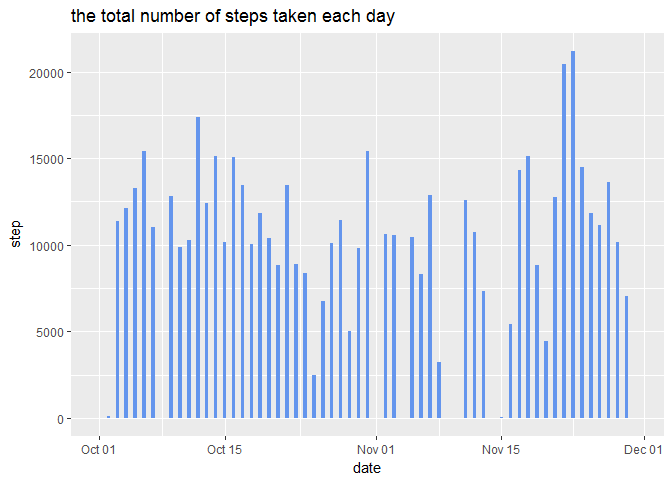
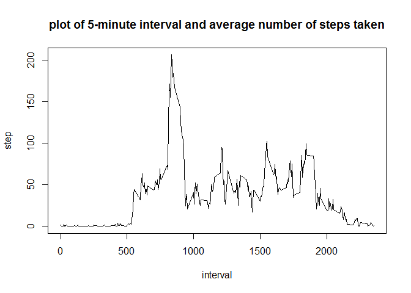
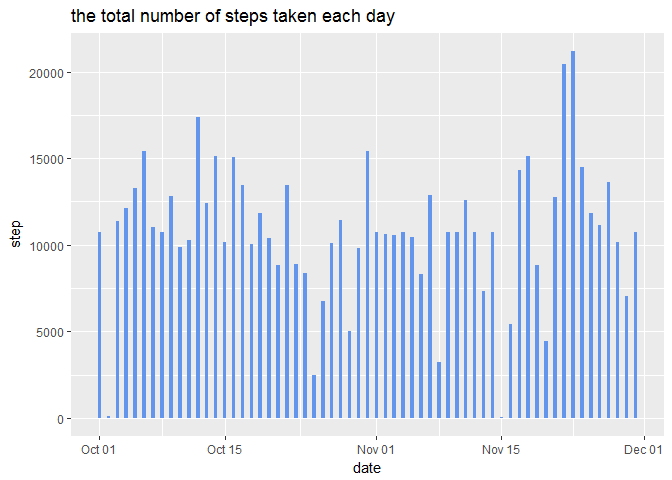
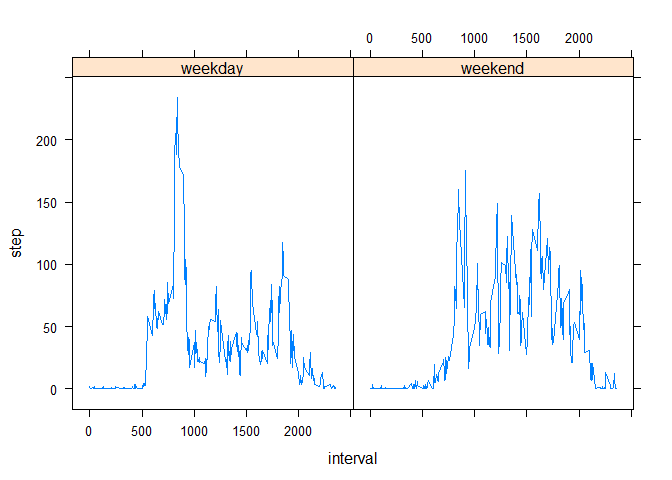

# Reproducible Research: Peer Assessment 1


## Loading and preprocessing the data

```r
library(dplyr)
library(lubridate)
library(ggplot2)
library(lattice)
activity <- read.csv("activity.csv", stringsAsFactors = FALSE)
activity$date <- ymd(activity$date)
```


## What is mean total number of steps taken per day?

Make a histogram of the total number of steps taken each day


```r
activity_g <- group_by(activity, date)
activity_sum <- summarize(activity_g, sum(steps, na.rm = TRUE))
names(activity_sum)[2] <- "step"
p <- ggplot(data=activity_sum, aes(x=date,y=step))
p <- p + geom_bar( stat="identity" , width = 0.4, fill = "cornflowerblue")
p <- p + labs(title = "the total number of steps taken each day") 
print(p)
```

<!-- -->


Calculate the mean and median of  total number of steps taken per day

```r
mean(activity_sum$step)
```

```
## [1] 9354.23
```

```r
median(activity_sum$step)
```

```
## [1] 10395
```
## What is the average daily activity pattern?
Make a time series plot of the 5-minute interval and the average number of steps taken, averaged across all days

```r
activity_g <- group_by(activity, interval)
activity_avg <- summarize(activity_g, mean(steps, na.rm = TRUE))
names(activity_avg)[2] <- "step"
plot(activity_avg$interval, activity_avg$step, type = "l", xlab = "interval", ylab = "step", main = "plot of 5-minute interval and average number of steps taken")
```

<!-- -->

Illustrate 5-minute interval, on average across all the days in the dataset, contains the maximum number of steps.

```r
activity_avg$interval[which.max(activity_avg$step)]
```

```
## [1] 835
```

## Imputing missing values
Count the total number of missing values in the dataset.

```r
 table(is.na(activity$steps))[[2]]
```

```
## [1] 2304
```

Create a new dataset that is equal to the original dataset but with the missing data filled in(use the mean for that 5-minute interval)

```r
activity_fill <- activity[!is.na(activity$steps),]
activity_tofix <- activity[is.na(activity$steps),1:2]
a<-merge(activity_avg,activity_tofix)
a <- unique(a)
activity_tofix <- data.frame(steps = a$step, date = a$date, interval= a$interval)
activity_fill <- rbind(activity_fill, activity_tofix)
dim(activity_fill)
```

```
## [1] 17568     3
```

Make a histogram of the total number of steps taken each day


```r
activity_g <- group_by(activity_fill, date)
activity_sum <- summarize(activity_g, sum(steps, na.rm = TRUE))
names(activity_sum)[2] <- "step"
p <- ggplot(data=activity_sum, aes(x=date,y=step))
p <- p + geom_bar( stat="identity" , width = 0.4, fill = "cornflowerblue")
p <- p + labs(title = "the total number of steps taken each day") 
print(p)
```

<!-- -->


Calculate the mean and median of  total number of steps taken per day

```r
mean(activity_sum$step)
```

```
## [1] 10766.19
```

```r
median(activity_sum$step)
```

```
## [1] 10766.19
```

These values differ from the estimates from the first part of the assignment. Imputing missing data on the estimates of the total daily number of steps makes the mean and median bigger.
## Are there differences in activity patterns between weekdays and weekends?
A panel plot containing a time series plot of the 5-minute interval and the average number of steps taken, averaged across all weekday days or weekend days.

```r
identify <- function(day){
    if(day == "Mon" | day =="Tue" | day =="Wed" |day =="Thu" |day =="Fri" ){return("weekday")}
    return("weekend")
}
activity["weekday"] <- sapply(weekdays(activity$date, abbreviate = TRUE),identify)
activity$weekday <- as.factor(activity$weekday)
activity_gr <- group_by(activity, interval, weekday)
activity_week <- summarize(activity_gr, step = mean(steps, na.rm = TRUE))
xyplot(step ~ interval | weekday,data = activity_week, type = "l", )
```

<!-- -->
